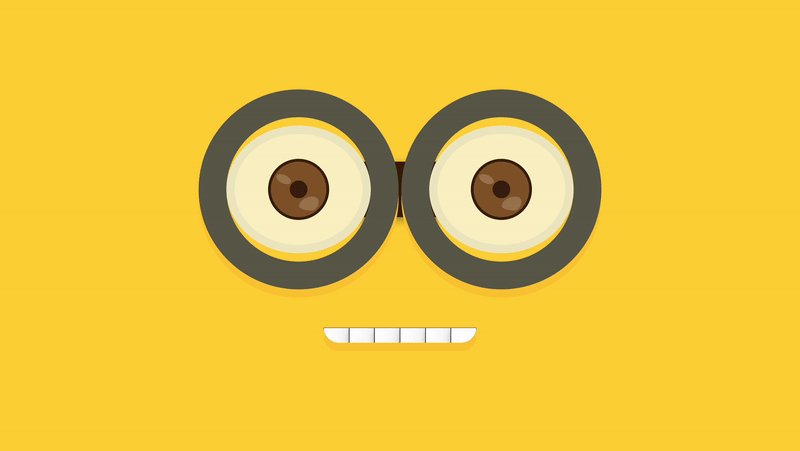

# Minion

This is a Minion created using HTML and CSS, moreover little animation is used to make it attractive. 

## Screenshot

## How to use 
  * Download the Code.
  * Open minion.html file in your browser.
